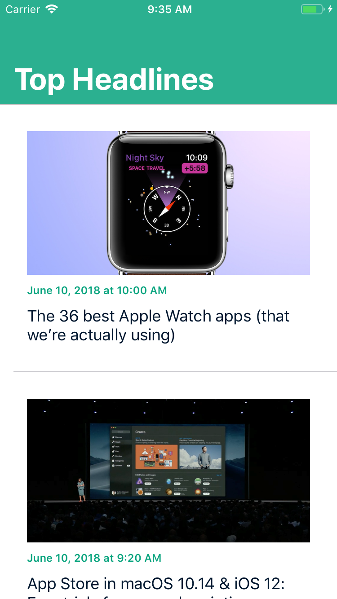

# iOS-12-performance-techniques

[![Swift Version][swift-image]][swift-url]

Sample News app to demonstrate performance optimization techniques on iOS 12.

</img>

See the `before` branch for the original app, and the `after` branch for the new app after applying performance optimizations.

## Requirements

- iOS 12.0+
- Xcode 10.0+

[swift-image]:https://img.shields.io/badge/swift-4.0-orange.svg
[swift-url]: https://swift.org/